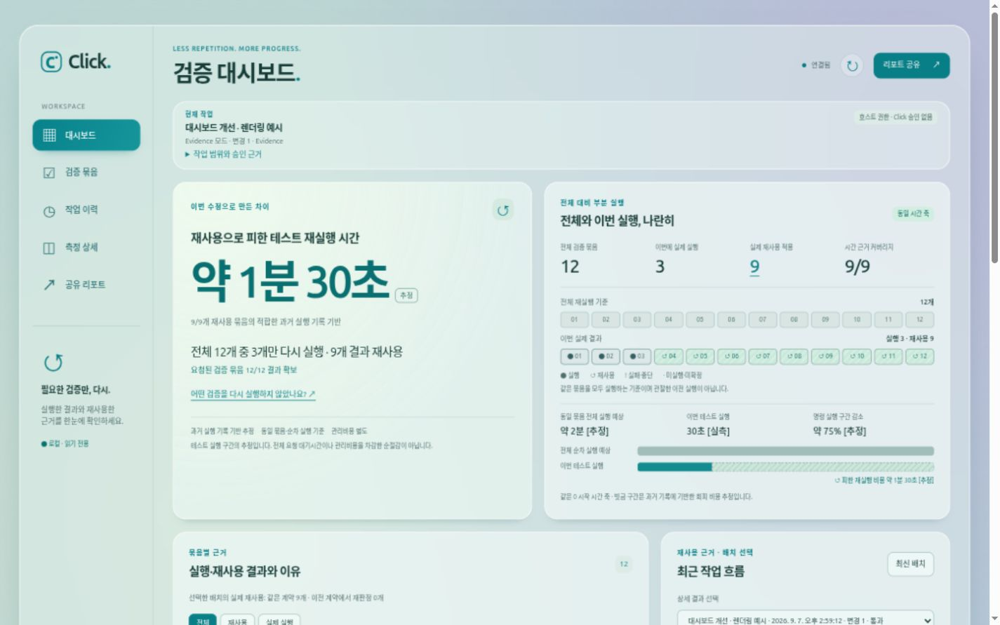

# 검증 대시보드 개선 기록

Click **0.90.0**의 기존 대시보드에 참고 이미지의 민트·청록색, 반투명 카드, 왼쪽 탐색 구조를 적용했다. 첫 화면에서 전체 검증 묶음과 이번에 실제로 실행·재사용한 묶음의 차이를 읽을 수 있다.

- [최종 보고서](reports/final.md): 변경 내용, 검증 결과와 제한
- [다국어 선택 추가](reports/languages.md): 한국어·영어·중국어 간체, 언어 저장 및 공유 일치
- [원본 프롬프트](SOURCE-PROMPT.md), [참고 이미지](reference-dashboard.png)
- [공통 규칙](COMMON.md), [계획](PLAN.md), [지표 계약](METRICS.md), [진행 기록](progress.json)
- [Phase 0](reports/phase-0.md), [Phase 1](reports/phase-1.md), [Phase 2](reports/phase-2.md), [Phase 3](reports/phase-3.md), [Phase 4](reports/phase-4.md), [Phase 5](reports/phase-5.md)
- [검증 자료의 출처](evidence/README.md)

아래 화면은 **렌더링용 예시 데이터**다. 12개 중 3개 실행·9개 재사용, 약 1분 30초는 운영 실측이나 제품 성능 보장이 아니다. 실제 Hook/runner 검증은 별도 자료에서 2개 중 1개 실행·1개 재사용을 확인했다.

모바일 캡처: [정상 부분 재사용](screenshots/mobile.jpg), [시간 자료 없음](screenshots/mobile-untimed.jpg), [검증 실패](screenshots/mobile-failed.jpg).

Observer는 off 상태에서도 검증·기존 재사용·계측·대시보드가 동작한다. 이 작업은 소스 변경이며 설치된 플러그인 캐시를 교체하지 않았다.
