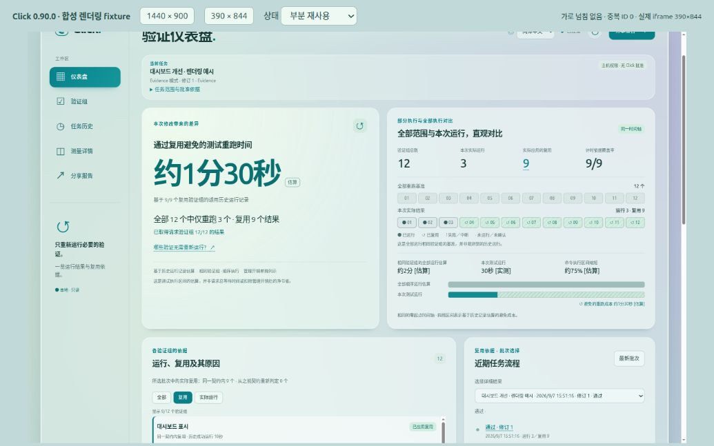
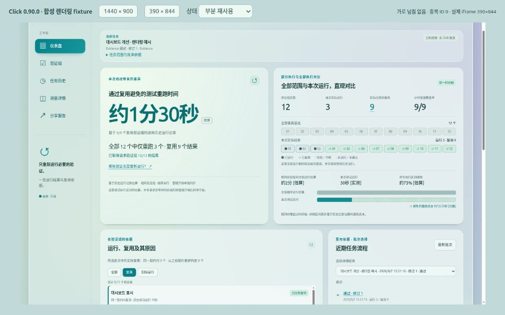

# 대시보드 언어 선택 — 한국어·영어·중국어 간체

2026-09-07, Click 0.90.0 소스의 대시보드에 언어 선택을 추가했다.

- 상단 선택기: **한국어 / English / 简体中文**. 기본값은 한국어다.
- 같은 viewer origin의 `localStorage`에 언어 코드만 저장한다. 새로고침 후에도 유지하며, 저장소가 차단되면 현재 페이지 내 전환은 계속 동작한다.
- 507개 공통 메시지로 탐색, 상태·오류·재사용 이유, 추정/실측/미측정, 날짜·시간 표현, 별도 비교, 접근성 레이블, 복사 및 HTML/JSON 공유 표현을 번역한다. 외부 번역 서비스나 런타임 의존성을 추가하지 않았다.
- 언어 변경은 이미 받은 snapshot을 다시 표시한다. 새 검증이나 별도 요청을 실행하지 않으며 선택한 과거 배치·필터와 canonical 수치·판정을 유지한다.
- 사용자가 작성한 작업명, 검증 묶음 이름과 원시 ID는 원문을 보존한다. 중국어 화면에서 한국어 작업명이 보이는 것은 의도된 동작이다.
- 보고서 v4에 선택적 `locale`을 추가했다. JSON의 표시 문구와 독립 HTML의 언어는 생성 시점에 고정하며, 이후 대시보드 언어 전환으로 기존 보고서가 변하지 않는다. 이전 v4의 locale 누락은 한국어로 처리한다.

변경 파일은 `hooks/click_shadow_dashboard.py`, 생성된 `dist/antigravity/hooks/click_shadow_dashboard.py`, `tests/test_click_efficiency.py`, README 및 VERIFICATION_EFFICIENCY.md다. 기존 대시보드 개선 변경을 보존했다. projection v7, 승인·재사용·runner 정책과 플러그인 버전은 변경하지 않았다.

## 검증

| 명령 | 결과 |
| --- | --- |
| `python3 -m unittest tests.test_click_efficiency tests.test_click_shadow_dashboard -q` | 36개 통과 |
| `python3 -m unittest tests.test_distribution_validation tests.test_repository_policy -q` | 45개 통과 |
| `git diff --check` | 통과 |

서로 다른 관련 테스트 총 **81개 통과**. 네 개의 다국어 회귀 시나리오는 언어·저장소 복구, 선택/필터/측정값 보존, 번역과 자리표시자 일치 및 예외 상태, 가져온 음수 비교의 언어 전환과 표본 보존을 검증한다. 기존 실제 Hook/runner→projection→export 테스트도 통과했다. 번역을 위해 benchmark 전체 실행을 반복하지 않았다.

브라우저에서 영어·중국어 UI, 새로고침 후 영어 유지, 번역 대상 static 문구의 한국어 누락 여부, 모바일 언어 선택, 언어 전환 후 재사용 9/12 필터 유지, 중국어 미측정 9/12 표시와 시간 그래프 숨김, 실패 상태를 확인했다. 모바일 영어의 추정 배지는 시간 숫자와 같은 줄에 놓이도록 조정했다.

반응형 검수에는 1440×900 및 390×844 크기의 실제 iframe을 사용했다. 스크롤바를 제외한 CSS 내용 너비는 각각 1429px와 379px이며 가로 넘침이 없었다. 브라우저 viewport override는 적용되지 않아 iframe 검수 화면을 사용했다. 캡처 파일은 도구가 반환한 원본 JPEG 1035×647이며, 바깥 검수 화면과 축소된 프레임을 포함한다.

일부 iframe textarea DOM 조회와 클립보드 완료 상태 확인은 브라우저 자동화 오류로 확인하지 못했다. 공유 문구와 언어 일치는 자동 테스트로 확인했다. 브라우저의 해당 조회 시점에 MutationObserver 오류가 기록됐으며, 대시보드와 검수 페이지는 MutationObserver를 사용하지 않는다. 이를 제품의 정상 동작 확인으로 계산하지 않았다.

## 화면

캡처는 합성 렌더링 예시이며 성능 실측이 아니다. 12개 중 3개 실행·9개 재사용 및 90초는 UI 확인용 데이터다.

모바일: [영어](../screenshots/languages/mobile-en.jpg), [중국어 간체](../screenshots/languages/mobile-zh.jpg).

테스트용 서버와 브라우저 탭은 종료했다. 설치된 플러그인 캐시는 교체하지 않았고 commit/push는 수행하지 않았다. 작업은 호스트 권한의 Click Evidence 모드이며 `approval_bound: false`, `execution_authority: host`다. 이 보고서는 canonical 완료 receipt를 대신하는 인증이 아니다.
