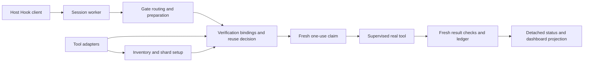

# Click global runtime review

Date: 2026-09-08. Base: `9b05f790baaf69220df4c0fe6fa0716d5f458951`,
branch `feature/multilang-expansion`, with the existing Phase 0–4 and Hook worker
changes retained. This review precedes Phase 5 and covers the whole runtime,
not only automatic sharding. Its records grant no execution or reuse authority.

## Execution ownership

Gate remains the public compatibility entry point; it does not become a second
verification engine. Adapters provide candidate command/inventory metadata.
Only the existing runner records an actual command outcome. UI projections and
timing history cannot issue claims or authorize reuse.

## Decisions across the codebase

| Area | Finding and change or retained boundary |
| --- | --- |
| Hook startup and plugin identity | The session worker already keeps heavy imports resident. Full source byte checking still detects replacement with restored mtimes. Retain that check: the locally writable plugin directory is not an immutable, trusted installation. |
| Gate, verification, runtime adapters | Reuse one environment serialization and one executable payload per binding group stage. Share the existing bounded file-digest stage with explicit input hashing. Keep command-specific profiles, actual cwd/environment, and fresh stages at prepare/claim/result boundaries. |
| Git verification snapshots | Resolve `HEAD^{tree}` once on the normal committed path. Probe `HEAD` separately only when needed to distinguish an unborn repository from an unreadable existing tree. Preserve the original snapshot digest representation. |
| Inventory and setup snapshots | Batch five Git metadata path queries into one invocation while still reading and hashing every protected file. Preserve individual queries for newline-containing worktree paths. No snapshot boundary or stability collection is removed. |
| Incremental history and state persistence | Replace repeatedly encoding progressively shorter histories with exact per-record byte accounting. Copy only retained records. Remove redundant copies after a detached history has already been built. All state callers benefit from this common history code. |
| Dashboard and status | Build current batch, batch summaries, retained totals and accounting from one detached history view per dashboard request. It uses one retention clock. State changes and new requests get new views. |
| Claim, result storage, recovery | Retain the existing lock, atomic replacement, and recovery snapshot behavior. Recovery copies and cross-process confirmation are not ordinary duplicate telemetry. No asynchronous success recording or process-death-based claim release is introduced. |
| Observer and process supervision | Preserve explicit observer profiles, bounded stdout/stderr draining, process-group termination, and uncertainty handling. Runner processes remain isolated; candidate analysis does not become PASS. |
| Compatibility wrappers and schemas | Keep public Gate aliases and versioned state/receipt consumers. These wrappers are compatibility boundaries rather than demonstrated expensive work. No speculative adapter framework, database, daemon, or schema migration is added. |
| Distribution and CI | Edit canonical sources and regenerate the distribution using the existing builder. Retain exact source parity, platform jobs, and official test inventory ownership. |

## Cost and freshness contract

The shared hash stage exists only for one group-binding call. Each input set is
still enumerated again, with current membership, file type, sensitivity, byte
limits, and before/after metadata checks. On Windows each record still reads
content because creation timestamps cannot establish content stability. New
authority boundaries always create a new stage. Watcher events and mtimes alone
never authorize reuse.

The inventory snapshot still scans the same complete file set and protects the
Git index, HEAD, config, worktree config, packed refs, and commit. Batching query
arguments reduces process starts without caching a previous Git state. The
ordinary verification snapshot still covers the tree, effective diff, and
protected untracked paths using its existing representation.

History retention still drops malformed/expired entries and applies the same
age, count and canonical JSON byte limits. Returned records remain detached;
editing a display view cannot mutate the saved ledger. Existing cancellation,
successor, partial failure and duplicate-delivery behavior must pass regression.

## Acceptance and sequence

1. Complete this global runtime prerequisite with focused regressions for
   bindings, history, Gate→runner execution, claims/results/recovery, and
   automatic sharding `init/status/refresh`, parent fallback and normal reuse.
2. Resume Phase 5 Vitest setup and proceed through the supplied phase gates.
3. Use Phase 9 for final complete inventory/OS verification and fair end-to-end
   cost comparisons. Structural call-count reductions are not whole-task,
   token-saving, or user-visible latency percentages.

Detailed execution results belong in [the runtime report](reports/global-runtime.md).
